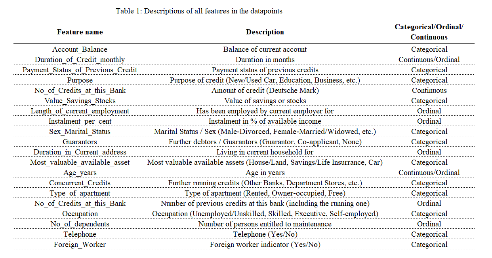
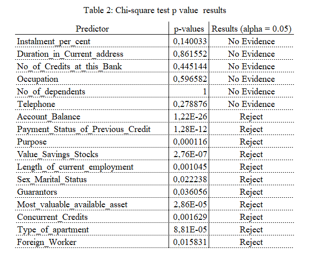

```{r setup, include=FALSE}
knitr::opts_chunk$set(echo = TRUE)
knitr::opts_chunk$set(warning = FALSE)
```

```{r, echo=FALSE, message=FALSE, warning=FALSE, results='hide'}
#| label: imports

# Load necessary library

library(brms)
library(ggplot2)
library(corrplot)
library(reshape2)
library(dplyr)
library(gridExtra)
library(grid)
library(caTools)
library(ggpubr)
library(ggcorrplot)
library(stats)
library(mgcv)
library(posterior)
library(bayesplot)
library(bayestestR)
library(cmdstanr)
library(pROC)

#For reproducibility
set.seed(123)
```

```{r, echo=FALSE, message=FALSE, warning=FALSE, results='hide'}
#| label: config brms

# Globally specfiy cmdstan backend for brms
options(brms.backend="cmdstanr")
options(brms.file_refit="on_change")
options(mc.cores=8)
```

```{r, echo=FALSE, message=FALSE, warning=FALSE, results='hide'}
data2 <- read.csv2("german.csv", header=TRUE, sep=";")
```

```{r, echo=FALSE, message=FALSE, warning=FALSE, results='hide'}
data2 <- data2 %>% 
  mutate(Account_Balance = case_when(
    Account_Balance == "2" ~ "No Balance or Debit",
    Account_Balance == "3" ~ "0 - 200 DM",
    Account_Balance == "4" ~ ">= 200 DM or 1+ year account",
    Account_Balance == "1" ~ "No account,"
  ))


data2 <- data2 %>% 
  mutate(Payment_Status_of_Previous_Credit = case_when(
    Payment_Status_of_Previous_Credit == "0" ~ "Hesitant Payment",
    Payment_Status_of_Previous_Credit == "1" ~ "Credits at other Bank",
    Payment_Status_of_Previous_Credit == "2" ~ "No Previous Credits",
    Payment_Status_of_Previous_Credit == "3" ~ "No Problem with Current Credits",
    Payment_Status_of_Previous_Credit == "4" ~ "Payback Previous Credits",
  ))

data2 <- data2 %>% 
  mutate(Purpose = case_when(
    Purpose == "0" ~ "Other",
    Purpose == "1" ~ "New Car",
    Purpose == "2" ~ "Used Car",
    Purpose == "3" ~ "Furniture",
    Purpose == "4" ~ "Radio/TV",
    Purpose == "5" ~ "Household Appliances",
    Purpose == "6" ~ "Repair",
    Purpose == "7" ~ "Education",
    Purpose == "8" ~ "Vacation",
    Purpose == "9" ~ "Retraining",
    Purpose == "10" ~ "Business",
  ))

data2 <- data2 %>% 
  mutate(Value_Savings_Stocks = case_when(
    Value_Savings_Stocks == "1" ~ "0",
    Value_Savings_Stocks == "2" ~ "< 100",
    Value_Savings_Stocks == "3" ~ "100 - 500",
    Value_Savings_Stocks == "4" ~ "500 - 1000",
    TRUE ~ "> 1000",
  ))

data2 <- data2 %>% 
  mutate(Length_of_current_employment = case_when(
    Length_of_current_employment == "1" ~ "Unemployed",
    Length_of_current_employment == "2" ~ "<= 1 Year",
    Length_of_current_employment == "3" ~ "1 - 4 Years",
    Length_of_current_employment == "4" ~ "4 - 7 Years",
    Length_of_current_employment == "5" ~ ">= 7 Years",
  ))

data2 <- data2 %>% 
  mutate(Instalment_per_cent = case_when(
    Instalment_per_cent == "1" ~ ">= 35%",
    Instalment_per_cent == "2" ~ "25% - 35%",
    Instalment_per_cent == "3" ~ "20% - 25%",
    Instalment_per_cent == "4" ~ "<20%",
  ))

data2 <- data2 %>% 
  mutate(Sex_Marital_Status = case_when(
    Sex_Marital_Status == "1" ~ "Male: Divorced",
    Sex_Marital_Status == "2" ~ "Male: Single",
    Sex_Marital_Status == "3" ~ "Female: Married/Widowed",
    Sex_Marital_Status == "4" ~ "Female",
  ))

data2 <- data2 %>% 
  mutate(Guarantors = case_when(
    Guarantors == "1" ~ "None",
    Guarantors == "2" ~ "Co-Applicant",
    Guarantors == "3" ~ "Guarantor",  
  ))

data2 <- data2 %>% 
  mutate(Duration_in_Current_address = case_when(
    Duration_in_Current_address == "1" ~ "< 1 year",
    Duration_in_Current_address == "2" ~ "1 - 4 years",
    Duration_in_Current_address == "3" ~ "4 - 7 years",
    Duration_in_Current_address == "4" ~ ">= 7 years",
  ))

data2 <- data2 %>% 
  mutate(Most_valuable_available_asset = case_when(
    Most_valuable_available_asset == "1" ~ "House/Land",
    Most_valuable_available_asset == "2" ~ "Savings/Life Insurance",
    Most_valuable_available_asset == "3" ~ "Car/Other",
    Most_valuable_available_asset == "4" ~ "No assets",
  ))

data2 <- data2 %>% 
  mutate(Type_of_apartment = case_when(
    Type_of_apartment == "1" ~ "Free Apartment",
    Type_of_apartment == "2" ~ "Rented Flat",
    Type_of_apartment == "3" ~ "Owner-occupied Flat",
  ))

data2 <- data2 %>% 
  mutate(No_of_Credits_at_this_Bank = case_when(
    No_of_Credits_at_this_Bank == "1" ~ "One",
    No_of_Credits_at_this_Bank == "2" ~ "Two/Three",
    No_of_Credits_at_this_Bank == "3" ~ "Four/Five",
    No_of_Credits_at_this_Bank == "4" ~ "6+",
  )) 

data2 <- data2 %>% 
  mutate(Concurrent_Credits = case_when(
    Concurrent_Credits == "1" ~ "At Other Banks",
    Concurrent_Credits == "2" ~ "At Department Stores",
    Concurrent_Credits == "3" ~ "No Others",
  )) 

data2 <- data2 %>% 
  mutate(Occupation = case_when(
    Occupation == "1" ~ "Unemployed/Unskilled with no RP",
    Occupation == "2" ~ "Unskilled",
    Occupation == "3" ~ "Skilled Worker",
    Occupation == "4" ~ "Executive/Self-employed",
  ))

data2 <- data2 %>% 
  mutate(No_of_dependents = case_when(
    No_of_dependents == "1" ~ "3+",
    No_of_dependents == "2" ~ "0-2",
  ))

data2 <- data2 %>% 
  mutate(Telephone = case_when(
    Telephone == "1" ~ "No",
    Telephone == "2" ~ "Yes",
  ))

data2 <- data2 %>% 
  mutate(Foreign_Worker = case_when(
    Foreign_Worker == "1" ~ "Yes",
    Foreign_Worker == "2" ~ "No",
  ))
```

```{r, echo=FALSE, message=FALSE, warning=FALSE, results='hide'}
# List of variables to be converted to factors
variables_to_factor <- c("Instalment_per_cent", "Duration_in_Current_address", 
                         "No_of_Credits_at_this_Bank", "Occupation", 
                         "No_of_dependents", "Telephone", "Account_Balance", 
                         "Payment_Status_of_Previous_Credit", "Purpose", 
                         "Value_Savings_Stocks", "Length_of_current_employment", 
                         "Sex_Marital_Status", "Guarantors", 
                         "Most_valuable_available_asset", "Concurrent_Credits", 
                         "Type_of_apartment", "Foreign_Worker")

# Loop through the list and convert each variable to a factor
for (variable in variables_to_factor) {
  data2[[variable]] <- as.factor(data2[[variable]])
}
```

```{r, echo=FALSE, message=FALSE, warning=FALSE, results='hide' }
# Change the reference level of the categorical variables
data2$Account_Balance <- relevel(data2$Account_Balance, ref = ">= 200 DM or 1+ year account")
data2$Value_Savings_Stocks <- relevel(data2$Value_Savings_Stocks, ref = "> 1000")
```

```{r, echo=FALSE, message=FALSE, warning=FALSE, results='hide'}
# Standardize the data
#data2$Duration_of_Credit_monthly <- scale(data2$Duration_of_Credit_monthly)[,1]
#data2$Credit_Amount <- scale(data2$Credit_Amount)[,1]
#data2$Age_years <- scale(data2$Age_years)[,1]
```

```{r, echo=FALSE, message=FALSE, warning=FALSE, results='hide'}
data_split <- sample.split(data2$Creditability, SplitRatio = 0.7)
train_data <- subset(data2, data_split == TRUE)
test_data <- subset(data2, data_split == FALSE)
```

\newpage

# Introduction

## Loan and Loan Process Explained

A loan is essentially a sum of money or other assets given to a party with the expectation of repayment in the future. This includes repaying the original loan amount plus any accrued interest and finance charges. Loans vary in type, including personal, commercial, secured, and unsecured, and can be a one-time amount or an open-ended credit line within a specified limit.

Loans serve various purposes, such as purchasing goods, consolidating debt, funding business ventures, or investing. They contribute to economic growth by increasing the money supply and fostering competition through new business financing.

When a bank receives a loan application, it has to decide whether to approve or reject the loan based on the applicant's profile. There are two types of risks associated with this decision: if the applicant is a good credit risk and is likely to repay the loan, then not approving the loan results in a loss of business to the bank; if the applicant is a bad credit risk and is not likely to repay the loan, then approving the loan results in a financial loss to the bank.

## Central Credit Risk Management Problem and Motivation

The financial sector relies heavily on credit risk management, and banks and other lending organizations are always looking to improve their approaches. But it's easier said than done to achieve success in credit risk management given the plethora of obstacles that today's institution must overcome. One of the most notable problems is the lack of skilled personnel as credit risk management requires a team with diverse skills of risk assessment.

Therefore, it is an urgent task to automate the process of detecting bad creditability to minimize risk and maximize return. This can be accomplished through various techniques of Machine Learning. In this report, I aim to detect bad creditability based on numerous features which are the factors that a lender can analyze about a borrower. This project will follow a Bayesian workflow approach to inject some prior knowledge from previous beliefs/researches and account for the uncertainty of the result.

## Outline

The report consists of the following parts: Introduction, Data Description, Models, Results, Discussion, Conclusion, and Appendices. First, we will formulate the problem and do some exploratory data analysis on the train data. Subsequently, in the Models section, we present two BRMS models, one pooled and one hierarchical, and justify their priors. Next, we analyze the stability of the models through some convergence diagnostics and prior sensitivity analysis, evaluate the predictive performance through posterior predictive checks and assessments, and then compare the two models. Finally, in the Conclusion section, we will summarize this project by concluding the performance and pointing out the issues and potential improvements. You can find the complete repository for the project [here](https://github.com/quan22022003/Modelling-Creditability-A-Bayesian-Approach)

# Data and Analysis Problem

## Dataset and Data Preprocessing

The German Credit Data was obtained from the [Kaggle website](https://www.kaggle.com/datasets/mpwolke/cusersmarildownloadsgermancsv/data). The data contains data 20 explanatory variables and 1 response variable, which is the classification whether an applicant is considered a Good or a Bad credit risk, for 1000 loan applicants. According to the author, this dataset comprises of these extracted attributes of borrowers:

```{r echo=FALSE, out.width='70%', out.length='85%', fig.align='center'}

```

Response variable:

-   `Creditability`: The indicator whether the subject has repaid the loan. The values is `1` if the subject repaid on time and is `0` if the subject has defaulted.

## Exploratory Data Analysis

Plotting the histograms for the features that correspond to the response variable from the training dataset, we can gain insights into the correlation between the explanatory variables and the response variable.

```{r, echo=FALSE, message=FALSE, warning=FALSE, results='hide'}

account_balance_plot <- ggplot(train_data, aes(x = Account_Balance, fill = as.factor(Creditability))) +
  geom_bar(position = "dodge") +
  geom_text(stat = "count", aes(label = ..count..), position = position_dodge(width = 0.9), vjust = -0.5, size = 6.5) +
  labs(title = "Account Balance by Creditability", 
       x = "Account Balance", 
       fill = "Creditability") +
  theme_minimal() +
  theme(axis.text=element_text(size=26.5),
        axis.title=element_text(size=34.5),
        title = element_text(size=28.5), legend.text=element_text(size=33.5), legend.title=element_text(size=33.5))

previous_credit_plot <- ggplot(train_data, aes(x = Payment_Status_of_Previous_Credit, fill = as.factor(Creditability))) +  geom_bar(position = "dodge") +
  geom_text(stat = "count", aes(label = ..count..), position = position_dodge(width = 0.9), vjust = -0.5, size = 6.5) +
  labs(title = "Payment Status of Previous Credit by Creditability", 
       x = "Status", 
       fill = "Creditability") +
  theme_minimal() + guides(fill="none") + 
  theme(axis.text=element_text(size=17),
        axis.title=element_text(size=34.5),
        title = element_text(size=24.5))

purpose_plot <- ggplot(train_data, aes(x = Purpose, fill = as.factor(Creditability))) +
  geom_bar(position = "dodge") +
  geom_text(stat = "count", aes(label = ..count..), position = position_dodge(width = 0.9), vjust = -0.5, size = 6.5) +
  labs(title = "Purpose by Creditability", 
       x = "Purpose", 
       fill = "Creditability") +
  theme_minimal() + guides(fill="none") + 
  theme(axis.text=element_text(size=30.5),
        axis.title=element_text(size=34.5),
        title = element_text(size=24.5))

savings_stocks_plot <- ggplot(train_data, aes(x = Value_Savings_Stocks, fill = as.factor(Creditability))) +
  geom_bar(position = "dodge") +
  geom_text(stat = "count", aes(label = ..count..), position = position_dodge(width = 0.9), vjust = -0.5, size = 6.5) +
  labs(title = "Value of Savings and Stocks by Creditability", 
       x = "Value", 
       fill = "Creditability") +
  theme_minimal() + guides(fill="none") +
  theme(axis.text=element_text(size=30.5),
        axis.title=element_text(size=34.5),
        title = element_text(size=24.5))

curr_empl_plot <- ggplot(train_data, aes(x = Length_of_current_employment, fill = as.factor(Creditability))) +
  geom_bar(position = "dodge") +
  geom_text(stat = "count", aes(label = ..count..), position = position_dodge(width = 0.9), vjust = -0.5, size = 6.5) +
  labs(title = "Length of Current Employment by Creditability", 
       x = "Year", 
       fill = "Creditability") +
  theme_minimal() + guides(fill="none") + 
  theme(axis.text=element_text(size=30.5),
        axis.title=element_text(size=34.5),
        title = element_text(size=24.5))

sex_marital_plot <- ggplot(train_data, aes(x = Sex_Marital_Status, fill = as.factor(Creditability))) +
  geom_bar(position = "dodge") +
  geom_text(stat = "count", aes(label = ..count..), position = position_dodge(width = 0.9), vjust = -0.5, size = 6.5) +
  labs(title = "Sex and Marital Status by Creditability", 
       x = "Sex and Marital Status", 
       fill = "Creditability") +
  theme_minimal() + guides(fill="none") +
  theme(axis.text=element_text(size=25.5),
        axis.title=element_text(size=34.5),
        title = element_text(size=24.5))

guarantor_plot <- ggplot(train_data, aes(x = Guarantors, fill = as.factor(Creditability))) +
  geom_bar(position = "dodge") +
  geom_text(stat = "count", aes(label = ..count..), position = position_dodge(width = 0.9), vjust = -0.5, size = 6.5) +
  labs(title = "Guarantor by Creditability", 
       x = "Guarantor", 
       fill = "Creditability") +
  theme_minimal() + guides(fill="none") + 
  theme(axis.text=element_text(size=30.5),
        axis.title=element_text(size=34.5),
        title = element_text(size=24.5))

asset_plot <- ggplot(train_data, aes(x = Most_valuable_available_asset, fill = as.factor(Creditability))) +
  geom_bar(position = "dodge") +
  geom_text(stat = "count", aes(label = ..count..), position = position_dodge(width = 0.9), vjust = -0.5, size = 6.5) +
  labs(title = "Most Valuable Available Asset by Creditability", 
       x = "Asset", 
       fill = "Creditability") +
  theme_minimal() + guides(fill="none") + 
  theme(axis.text=element_text(size=30.5),
        axis.title=element_text(size=34.5),
        title = element_text(size=24.5))

worker_plot <- ggplot(train_data, aes(x = Foreign_Worker, fill = as.factor(Creditability))) +
  geom_bar(position = "dodge") +
  geom_text(stat = "count", aes(label = ..count..), position = position_dodge(width = 0.9), vjust = -0.5, size = 6.5) +
  labs(title = "Foreign Workers by Creditability", 
       x = " Foreign Worker", 
       fill = "Creditability") +
  theme_minimal() + guides(fill="none") + 
  theme(axis.text=element_text(size=30.5),
        axis.title=element_text(size=34.5),
        title = element_text(size=24.5))

concurr_credits_plot <- ggplot(train_data, aes(x = Concurrent_Credits, fill = as.factor(Creditability))) +
  geom_bar(position = "dodge") +
  geom_text(stat = "count", aes(label = ..count..), position = position_dodge(width = 0.9), vjust = -0.5, size = 6.5) +
  labs(title = "Concurrent Credits by Creditability", 
       x = "Concurrent Credits", 
       fill = "Creditability") +
  theme_minimal() + guides(fill="none") + 
  theme(axis.text=element_text(size=30.5),
        axis.title=element_text(size=34.5),
        title = element_text(size=24.5))

apartment_type_plot <- ggplot(train_data, aes(x = Type_of_apartment, fill = as.factor(Creditability))) +
  geom_bar(position = "dodge") +
  geom_text(stat = "count", aes(label = ..count..), position = position_dodge(width = 0.9), vjust = -0.5, size = 6.5) +
  labs(title = "Apartment Types by Creditability", 
       x = "Type", 
       fill = "Creditability") +
  theme_minimal() + guides(fill="none") + 
  theme(axis.text=element_text(size=30.5),
        axis.title=element_text(size=34.5),
        title = element_text(size=24.5))

```

```{r, fig.align='center', fig.height=13, fig.width=33, echo=FALSE, message=FALSE, warning=FALSE}
ggarrange(account_balance_plot, apartment_type_plot, ncol=2, common.legend = TRUE)
ggarrange(previous_credit_plot, sex_marital_plot, ncol=2)
ggarrange(guarantor_plot, asset_plot, ncol = 2)
ggarrange(concurr_credits_plot, savings_stocks_plot, ncol=2)
ggarrange(worker_plot, curr_empl_plot, ncol=2)
purpose_plot
```

There is one noticeable concern that can be readily pointed out from the histograms: There are under-representation of many classes in various predictor variables, including `Foreign_Worker`, `Concurrent_Credits`, `Guarantor`. For example, for the variable `Foreign_Worker`, there are 678 foreign workers, while there are only 24 natives.

Finally, the fearutes left are the numerical features `Duration_of_Credit_monthly`, `Credit_Amount`, and `Age_years`. We plot the pairwise scatter plots to detect any interesting patterns from the data.

```{r, echo=FALSE, message=FALSE, warning=FALSE, results='hide'}
# Selecting only the numerical variables and the response variable
numeric_vars <- c("Duration_of_Credit_monthly", "Credit_Amount", "Age_years", 
                  "Creditability")
numeric_data <- train_data[, numeric_vars]
numeric_data$Creditability <- as.factor(numeric_data$Creditability)
```

```{r, echo=FALSE, message=FALSE, warning=FALSE, results='hide', fig.align='center'}
pairs(numeric_data[, 1:3], pch = c(16,17)[numeric_data$Creditability], gap=0, upper.panel = NULL, col=c(rgb(0, 0, 1, 0.5), rgb(1, 0, 0, 0.5))[numeric_data$Creditability])
par(xpd=TRUE)
legend(0.75, 0.75, legend = levels(numeric_data$Creditability), pch = c(16, 17), col = c(rgb(0, 0, 1, 0.5), rgb(1, 0, 0, 0.5)), cex = 1)
```

As shown from the figure, it seems like there are no significant patterns from the numerical features that we can notice with just visualizations.

To further inspect the correlation between these features, we calculation the Pearson's correlation coefficients for each pair of features.

```{r, fig.align='center', echo=FALSE, message=FALSE, warning=FALSE, out.width='55%', out.length='80%'}
# Calculate the correlation matrix
numeric_data$Creditability <- as.numeric(numeric_data$Creditability)
correlation_matrix <- cor(numeric_data)

# We will use 'melt' from reshape2 to transform the data for ggplot
melted_correlation <- melt(correlation_matrix)

# Plotting the heatmap with labels
ggplot(melted_correlation, aes(Var1, Var2, fill = value)) +
  geom_tile() +
  geom_text(aes(label = sprintf("%.2f", value)), color = "black", size = 3) +
  scale_fill_gradient2(low = "blue", high = "red", mid = "white", 
                       midpoint = 0, limit = c(-1,1), space = "Lab", 
                       name="Pearson\nCorrelation") +
  theme_minimal() +
  coord_fixed() +
  labs(x = "", y = "", title = "Correlation Heatmap of Numerical Variables with
       Risk Flag") +
  theme(axis.text.x = element_text(angle = 45, vjust = 1, hjust=1),
        axis.text.y = element_text(angle = 45, vjust = 1, hjust=1))

```

From the correlation plot, it can be observed that there is some correlation between `Credit_Amount` and `Duration_of_Credit_monthly`. The effects of multicollinearity can be severe for ordinary logistics regression, but that does not hold for Bayesian Logistics Regression. Therefore, there is not much wariness about this matter in this modelling problem.

## Data Processing and Feature Selection

First of all, we split 70% of the dataset into training dataset and 30% into testing dataset. While the training set is used for the explanatory data analysis and model fitting, the test set is utilized for predictions and accuracy testing purposes.

The next step in this workflow is feature selection, which is crucial to dimension reduction, model performance, and runtime improvement. Therefore, as this dataset contains numerous categorical variables, we only choose a subset of them as explanatory variables for the models. By analyzing the relationship between the response variable and the explanatory variables using the Chi-Square Test for categorical variables, we can identify the final set of explanatory variables for the models by selecting those whose Chi-Square tests show significant associations.

### Chi-Square Test:

-   **Hypotheses**:
    -   Null Hypothesis (H0): There is no association between the predictor variable and target variable.
    -   Alternate Hypothesis (H1): There is a significant association between the the predictor variable and target variable.
-   **Significance level (**$\alpha$): ($\alpha$) = 0.05.

```{r, echo=FALSE, message=FALSE, warning=FALSE, results='hide'}
# Define a list to store the results
chi_square_results <- list()

# Expanded list of categorical predictors
categorical_predictors <- c("Instalment_per_cent", "Duration_in_Current_address", 
                            "No_of_Credits_at_this_Bank", "Occupation", 
                            "No_of_dependents", "Telephone", "Account_Balance", 
                            "Payment_Status_of_Previous_Credit", "Purpose", 
                            "Value_Savings_Stocks", "Length_of_current_employment", 
                            "Sex_Marital_Status", "Guarantors", 
                            "Most_valuable_available_asset", "Concurrent_Credits", 
                            "Type_of_apartment", "Foreign_Worker")

# Loop through each predictor and perform the Chi-square test
for(predictor in categorical_predictors) {
  # Create contingency table
  contingency_table <- table(train_data[[predictor]], train_data$Creditability)
  
  # Perform the Chi-square test
  test_result <- chisq.test(contingency_table)
  
  # Store the result
  chi_square_results[[predictor]] <- test_result$p.value
}

# Convert results to a data frame for easy viewing
chi_square_results_df <- data.frame(P_Value = unlist(chi_square_results))

# Add a new column 'Reject_Null' to the data frame
chi_square_results_df$Reject_Null <- chi_square_results_df$P_Value < 0.05
```

```{r echo=FALSE, out.width='60%', out.length='75%', fig.align='center'}

```

From the result table, we conclude that `Instalment_per_cent`, `Duration_in_Current_Address`, `No_of_Credits_at_this_Bank`, `Occupation`, `No_of_dependents`, and `Telephone` do not show a statistically significant association with the response variable `Creditability`. This outcome indicates that, based on our Chi-square analysis, these factors may not be critical predictors for `Creditability` in the context of this dataset.

# Models Description

In this project, two models will be used and analyzed: a Pooled model and a Hierarchical model. For the statistical model, Logistic Regression is chosen as the project aims to classify a binary outcome (Good Creditability: “1”, Bad Creditability: “0”).

**Mathematical Expression for Both Models**

The Logistic Regression model used to classify creditability y can be expressed as follows:

$$
\begin{aligned}
\pi = \Pr[Y_i = y | x_{1,i}, \ldots, x_{m,i}] = 
\begin{cases} 
    \frac{1}{1 + e^{-LP_i}}, & \text{if } y = 1 \\
    -\frac{1}{1 + e^{LP_i}}, & \text{if } y = 0 
\end{cases}
\end{aligned}
$$

where the linear predictor $LP_{i}$ is the weighted sum of the independent variables, representing the log-odds of an observation $\textit{i}$ for our Bernoulli-distributed random variable $Y_{i}$

$$ LP_{i} = \boldsymbol{\beta} \cdot \mathbf{X}_{i} $$

with $\boldsymbol{\beta} \in \mathbb{R}^{m+1}$ is the vector of the regression coefficients, and $\mathbf{X}_{i}\in \mathbb{R}^{m+1}$ are the explanatory variables indexed by $\textit{i}$ for m predictors. In practical terms, parameters $\boldsymbol{\beta}$ will estimate the change in the log-odds of the outcome when the variable changes from its reference level (usually 0) to the other level for categorical variables, or the change in the log-odds of the outcome for continuous numerical variables.

With the logit (log-odds) link function $g(\pi)$ = $\ln \left( \frac{\pi}{1-\pi} \right)$ we can logit-transform the first function to obtain the linear predictors:

$$ 
\begin{aligned}
&\text{logit}(\pi) = \boldsymbol{\beta} \cdot \mathbf{X}_{i} \\
\Leftrightarrow &\log \left(\frac{Pr[Y_{i}=y]}{1-Pr[Y_{i}=y]}\right)= \boldsymbol{\beta} \cdot \mathbf{X}_{i}
\end{aligned}
$$

And with the probit link function $g(x)$ = $\Phi^{-1}(x)$ yields the likelihood for a single observation

$$ 
y_i \sim \text{Bernoulli} \left[ \Phi(\boldsymbol{\beta} \cdot \mathbf{X}_{i})  \right]
$$ If independent prior distributions are adopted, the joint posterior distribution for $\boldsymbol{\beta}$ is proportional to the product of the priors and the $\mathcal{N}$ likelihood:

$$
f(\boldsymbol{\beta} \mid \boldsymbol{y}, \boldsymbol{X}) \propto \prod_{i=0}^m f(\beta_k) \times \prod_{j=1}^\mathcal{N} f(y_j)
$$

## Pooled Logistic Regression Model

For the Pooled Logistic Regression Model, we will use the following features: `Account_Balance`, `Payment_Status_of_Previous_Credit`, `Purpose`, `Value_Savings_Stocks`, `Length_of_current_employment`, `Sex_Marital_Status`, `Guarantors`, `Most_valuable_available_asset`, `Concurrent_Credits`, `Type_of_apartment`, `Credit_Amount`, `Duration_of_Credit_monthly`, `Age_years`. You can inspect the BRMS code for the model [here](#pooled).

### Priors Justification

For the $\beta$ coefficients, a common choice is to use normal distributions as priors due to their mathematical convenience and the central limit theorem. For example, $\beta_i \sim \mathcal{N}(0, \sigma^2)$, where $\sigma^2$ is the variance for most of the parameters. In this project, we will choose 0 as location parameter and 10 as the variance for most of the parameters, expressing our humble prior knowledge about how the input variables can affect the target variable.

$$ 
\beta_j \sim \mathcal{N}(0, 10) \text{ } \forall j \in \{1, 2, 3, \ldots, k\} \setminus \{\text{Account Balance}, \text{Value Saving Stocks}\}
$$

However, for the variables `Account_Balance` and `Value_Savings_Stocks`, we assume a informative prior:

$$
\beta_{\text{Account Balance}}, \beta_{\text{Value Saving Stocks}} \sim \mathcal{N}(-1.5, 0.5)
$$

The justification for our choice of this prior follows. According to [Treece, K. et al. (2023)](#references), capital, representation of the commitment to contribute some of the borrower's own funds, is taken into account by the lenders. For the variable Account_Balance, the baseline category is the one having highest value (`> 1000`). Similarly, for the variable Value_Savings_Stocks, the baseline category is also the category has highest value (`>= 200 DM or 1+ year account`). Therefore, it is reasonable to assume that the log-odds of creditability decreases when these variables' values move from the baseline categories to the other categories.

```{r, echo=FALSE, message=FALSE, warning=FALSE}
# Priors
priors_model1 <- c(
  prior(normal(0, 10), class = "b"), 
  prior(normal(0, 10), class = "Intercept"),
  prior(normal(-1.5, 0.5), class = "b", coef = "Account_Balance0M200DM"),
  prior(normal(-1.5, 0.5), class = "b", coef = "Account_BalanceNoaccount"),
  prior(normal(-1.5, 0.5), class = "b", coef = "Account_BalanceNoBalanceorDebit"),
  prior(normal(-1.5, 0.5), class = "b", coef = "Value_Savings_Stocks<100"),
  prior(normal(-1.5, 0.5), class = "b", coef = "Value_Savings_Stocks0"),
  prior(normal(-1.5, 0.5), class = "b", coef = "Value_Savings_Stocks100M500"),
  prior(normal(-1.5, 0.5), class = "b", coef = "Value_Savings_Stocks500M1000"))

# Specify a Bayesian model formula
model1form <- bf(Creditability ~ 1 + Account_Balance + Payment_Status_of_Previous_Credit + 
                   Purpose + Value_Savings_Stocks + Length_of_current_employment + 
                   Sex_Marital_Status + Guarantors + Most_valuable_available_asset + 
                   Concurrent_Credits + Type_of_apartment + Duration_of_Credit_monthly + Credit_Amount + Age_years)
```

```{r, echo=FALSE, message=FALSE, warning=FALSE}
if (!dir.exists("cache")) {
  dir.create("cache")
}

model1 <- brm(
  # Specify the formula used
  model1form, 
  # Specify the dataset used to train the model             
  data = train_data, 
  # Specify the observation model family
  family = bernoulli("logit"),
  # Pass the prior to the model
  prior = priors_model1,
  # Specify the number of chains used in the MCMC algorithm
  chains=4,
  # Specify the number of total draws and warm-up draws
  iter=4000,
  # Cache the result
  file = file.path("cache", "model1"),
  # Declare the backend used
  backend="cmdstanr",
  warmup=1000, 
  # Specify the number of CPU cores used
  cores=8)
```

## Hierarchical Logistic Regression Model

For the Hierarchical Logistic Regression Model, we will use the same features as the Pooled Model as predictors. However, Hierarchical Model is more complex, as the data is categorized into G groups, with each category is a class in the variable Occupation. We believe that for each class of `Occupation`, the influences of `Account_Balance`, `Payment_Status_of_Previous_Credit`, and `Length_of_current_employment` on the log-odds of `Creditability` are different. For example, for two people having the same status of previous credit, we believe the person who is a skilled worker is possibly more creditable.

Let G: D $\to$ G is a surjective mapping from the set of datapoints D to the set of categories G of variable `Occupation`. Then we have the following Linear Predictor $LP_{i}$:

$$ 
LP_{i} = \boldsymbol{\beta_0} + \mathbf{X}_i \boldsymbol{\beta} + \mathbf{Z}_i \boldsymbol{u}_{G(i)} 
$$

-   $\alpha$: The global intercept (Intercept).
-   $\mathbf{X}_i$: The vector of predictor values for observation $i$.
-   $\boldsymbol{\beta}$: The vector of fixed-effects coefficients (class "b").
-   $\mathbf{Z}_i$: The vector of group-level predictor values for observation $i$.
-   $\boldsymbol{u}_{G(i)}$: The vector of random effects for group $G(i)$.

You can inspect the BRMS code for the model [here](#hierarchical).

```{r,echo=FALSE, message=FALSE, warning=FALSE}
# Declare priors for the Hierarchiccal model
# Priors for non-grouped parameters
non_grouped_priors_model2 <- c(
  prior(normal(0, 10), class = "b"), 
  prior(normal(0, 10), class = "Intercept"),
  prior(normal(-1.5, 0.5), class = "b", coef = "Account_Balance0M200DM"),
  prior(normal(-1.5, 0.5), class = "b", coef = "Account_BalanceNoaccount"),
  prior(normal(-1.5, 0.5), class = "b", coef = "Account_BalanceNoBalanceorDebit"),
  prior(normal(-1.5, 0.5), class = "b", coef = "Value_Savings_Stocks<100"),
  prior(normal(-1.5, 0.5), class = "b", coef = "Value_Savings_Stocks0"),
  prior(normal(-1.5, 0.5), class = "b", coef = "Value_Savings_Stocks100M500"),
  prior(normal(-1.5, 0.5), class = "b", coef = "Value_Savings_Stocks500M1000"))

# Priors for grouped parameters
grouped_priors_model2 <- c(
  # Prior for standard deviations of random effects
  prior(cauchy(0, 2), class = "sd"), 
  # Prior for the correlation matrix of random effects
  prior(lkj(2), class = "cor")) 


# Concatenate two parts into a complete set of priors
priors_model2 <- c(non_grouped_priors_model2, grouped_priors_model2)


# Specify a Bayesian model formula
model2form <- bf(Creditability ~ 1 + Account_Balance + Payment_Status_of_Previous_Credit + 
          Purpose + Value_Savings_Stocks + Length_of_current_employment + 
          Sex_Marital_Status + Guarantors + Most_valuable_available_asset + 
          Concurrent_Credits + Type_of_apartment +  Duration_of_Credit_monthly + Credit_Amount + Age_years + 
          (1 + Length_of_current_employment + Account_Balance + 
          Payment_Status_of_Previous_Credit | Occupation))

```

```{r, echo=FALSE, message=FALSE, warning=FALSE}
model2 <- brm(
  # Specify the formula used
  model2form, 
  # Specify the dataset used to train the model             
  data = train_data, 
  # Specify the observation model family             
  family = bernoulli("logit"),
  # Pass the prior to the model             
  prior = priors_model2,
  # Specify the number of chains used in the MCMC algorithm             
  chains=4,
  # Specify the number of total draws and warm-up draws             
  iter=4000, warmup=1000, 
  # Cache the result             
  file="cache/model2",
  # Declare the backend used
  backend="cmdstanr",
  # Specify the number of CPU cores used             
  cores=8)
```

### Priors Justification

For fixed effects (`class="b"`), we use the same set of priors for the coefficients of predictors $$ 
\beta_j \sim \mathcal{N}(0, 10) \text{ } \forall j \in \{1, 2, 3, \ldots, k\} \setminus \{\text{Account Balance}, \text{Value Saving Stocks}\}
$$ The logical reasoning for prior choice remains the same as for pooled model.

For Random Effects Standard Deviations (`class = "sd"`), we use a weakly informative Cauchy priors $$\sigma_{\text{Occupation}} \sim \text{Cauchy}(0, 2)$$.

For Correlation (`class = "cor"`), we use LKJ prior for the correlation matrix of random slopes within each `Occupation`

$$ \Omega_{u} \sim \text{LKJ}(2) $$

# Results and Comparisons

## Convergence Diagnostics

### $\hat{R}$ Diagnostics

The $\hat{R}$ values of the parameters for two models are plotted into two histograms as follows:

```{r, warning=FALSE, message=FALSE, echo=FALSE, out.width='70%', fig.align='center'}
r_hat_model1 = summary(model1)$fixed$Rhat
r_hat_model2 = summary(model2)$fixed$Rhat

rhat_model1 <- mcmc_rhat_hist(r_hat_model1) + 
  labs(title="Pooled model")  +
  theme(plot.title = element_text(hjust = 0.5))

rhat_model2 <- mcmc_rhat_hist(r_hat_model2) + 
  labs(title="Hierarchical model")  +
  theme(plot.title = element_text(hjust = 0.5))

ggarrange(rhat_model1, rhat_model2, ncol=2, common.legend=TRUE)
```

From the histograms, we can observe that the all $\hat{R}$ values are smaller than 1.05. This suggests that the good convergence across chains.

### Divergences Diagnostics

A divergent transition occurs when the Hamiltonian Monte Carlo sampler is unable to accurately simulate the trajectory through the parameter space. This typically happens in regions of high curvature in the posterior distribution, which are difficult for the sampler to navigate. Divergent transitions are a sign that the sampler may not be exploring the posterior distribution effectively, which can lead to biased estimates and unreliable inference. They indicate that the sampler's trajectory had to be prematurely halted to avoid numerical errors.

In this section, we will examine the number of divergent draws of the two models.

```{r, echo=FALSE, message=FALSE, warning=FALSE, results='hide'}
divergent_draws <- function(model, name) {
  
  nut_params_fit <- nuts_params(model) |>
                      filter(Parameter=="divergent__") |>
                      count(Value)
  
  divergent <- nut_params_fit$n[which(nut_params_fit$Value == 1)]
  normal <- nut_params_fit$n[which(nut_params_fit$Value == 0)]
  
  if (!length(divergent)) {
    divergent <- 0
  }
  
  matrix <- matrix(c(divergent, normal), 
         ncol=1)
  
  dimnames(matrix) <- list(c("Divergent", "Convergent"), c("Transitions"))
  
  cat(sprintf("%s model:\n", name))
  matrix
}
```

**Number of Divergent draws**:

```{r, echo=FALSE, message=FALSE, warning=FALSE, comment=""}
divergent_draws(model1, "Pooled")
```

```{r, echo=FALSE, message=FALSE, warning=FALSE, comment=""}
divergent_draws(model2, "Hierarchical")
```

For the pooled model, we have 0 divergent transitions. However, on the contrary, hierarchical model has $\sim$ 1 divergent transitions. While this number should not be ignored, occasional divergences might not significantly impact the overall inference, considering the huge number of total draws of 12000.

### Effective Sample Size (ESS) diagnostics

The Effective sample size (ESS) values of the parameters for two models are plotted into two histograms as follows:

```{r, warning=FALSE, message=FALSE, results='hide', echo=FALSE}
ess_plot <- function(model) {
  ess_values <- summary(model)$fixed$Bulk_ESS
  
  ess_data <- data.frame(
    ess = ess_values,
    above_400 = ess_values > 400
  )
  
  ggplot(ess_data, aes(x = ess, fill = above_400)) +
    geom_histogram(binwidth = 1000, color = "black") +
    scale_fill_manual(values = c("gray", "blue")) +
    labs(title = "Histogram of Effective Sample Sizes",
         x = "Effective Sample Size",
         y = "Count",
         fill = "ESS > 400") +
    theme_minimal()
}
```

```{r, warning=FALSE, message=FALSE, echo=FALSE, out.width='70%', fig.align='center'}
ess_model1 <- ess_plot(model1) +
  labs(title="Pooled model")  +
  theme(plot.title = element_text(hjust = 0.5))

ess_model2 <- ess_plot(model2) + 
  labs(title="Hierarchical model")  +
  theme(plot.title = element_text(hjust = 0.5))

ggarrange(ess_model1, ess_model2, ncol=2, common.legend=TRUE)
```

In overall, we have obtained good ESS for all parameters since they are all greater than 100 times the number of chains (=4) [Vehtari et al. 2021](#references). Effective Sample Sizes across our parameters were robust, providing confidence in the precision of our posterior estimates. The absence of significant divergences further supported the adequacy of our sampling process.

### Summary

Given these satisfactory diagnostic results, we did not make adjustments to the model's specifications or priors. This decision was based on the overall adequacy of the convergence indicators, suggesting that the model was capturing the underlying data structure effectively.

Therefore, we are confident in the reliability of our model's results. The diagnostics support the validity of our findings, though we acknowledge the importance of continual vigilance for potential convergence issues in Bayesian modeling. Future studies may explore further refinements in model specifications, particularly if working with more complex datasets or different model structures.

## Model Comparisons

### Posterior Predictive Performance Checks

The following plot displays the observed frequencies of the response variable in the data to the frequencies simulated from the model. It's particularly useful for categorical data in this context. The bars show the distribution of creditability (by count) and the predicted number of each category (`Good` or `Bad`) from the model, with the median as a dot and error bar.

Ideally, the observed and simulated data should be similar. If the models fit the data well, the bars for the observed data should fall within the range of variation of the bars for the simulated data.

```{r, echo=FALSE, message=FALSE, warning=FALSE,out.width='70%', fig.align='center'}
model1_bars <- pp_check(model1, type="bars", newdata=test_data)  + 
  labs(title="Pooled model")  +
  theme(plot.title = element_text(hjust = 0.5))

model2_bars <- pp_check(model2, type="bars", newdata=test_data)  + 
  labs(title="Hierarchical model")  +
  theme(plot.title = element_text(hjust = 0.5))

ggarrange(model1_bars, model2_bars, ncol=2, common.legend=TRUE, legend="right")
```

From the plots, it can be observed that the two models replicate the original data quite well, with bars of the observed data all fall within the range of the variation of the simulated data. In the predictive performance assessment section, we will provide numerical metrics to evaluate the true performance of both models’ predicting ability.

The two following plots will show the distribution of mean calculated from the simulated posterior predictive data. The observed statistic from `test_data` is highlighted and overlaid on this distribution. If the model fits the data well, the observed mean should fall within the range of the distribution of the simulated statistic. This would indicate that the model can reproduce summary statistics similar to what is observed in the actual data.

```{r, echo=FALSE, message=FALSE, warning=FALSE,out.width='70%', fig.align='center'}
model1_stat <- pp_check(model1, type="stat", newdata=test_data)  + 
  labs(title="Pooled model")  +
  theme(plot.title = element_text(hjust = 0.5))

model2_stat <- pp_check(model2, type="stat", newdata=test_data)  + 
  labs(title="Hierarchical model")  +
  theme(plot.title = element_text(hjust = 0.5))

ggarrange(model1_stat, model2_stat, ncol=2, common.legend=TRUE, legend="right")
```

Upon examining our PPC plots, we observe a commendable alignment in the central tendencies between the observed and simulated data as the modes of the predictive posterior distribution really near the true mean, suggesting that our model effectively captures the primary patterns in the creditability data. However, notable discrepancies in the tails of the distribution indicate potential underestimation of extreme values. This could imply model misspecification, perhaps due to not fully accounting for high-risk profiles in the data.

Further, the underrepresentation of certain creditability outcomes in the simulated data suggests that incorporating additional predictors or exploring interaction effects could enhance our model's accuracy. For instance, incorporating economic indicators might improve the model's ability to capture these tail behaviors.

### Predictive Performance Assesments

To gain a more comprehensive understanding of the predictive performance of our models, we construct a confusion matrix for each model. For every observation in the test dataset, we calculate the mean prediction based on 12,000 samples. Using a threshold of 0.5, we classify each data point as Good Creditability if the mean prediction exceeds this threshold; otherwise, we classify it as Bad Creditability.

The predictions are then compared to the true labels to compute the number of True Positive (TP), False Positive (FP), True Negative (NG), False Negative (NG).

```{r, echo=FALSE, message=FALSE, warning=FALSE, results='hide'}
predicted_classes <- function(model, data, hierarchical=FALSE) {
  #Get posterior predictions for the test set
  if (hierarchical) {
    posterior_predict <- posterior_predict(model, newdata=data, allow_new_levels=TRUE, sample_new_levels="gaussian", cores=8)
  } else {
    posterior_predict <- posterior_predict(model, newdata=data)
  }
  
  #Calculate the mean of the posterior predictions
  predicted_probabilities <- colMeans(posterior_predict)
  
  predicted_classes <- ifelse(predicted_probabilities > 0.5, 1, 0)
}
```

```{r, echo=FALSE, message=FALSE, warning=FALSE, results='hide', comment=""}
# For pooled model:
predicted_classes_model1 <- predicted_classes(model1, test_data)

# For hierarchical model:
predicted_classes_model2 <-  predicted_classes(model2, test_data)
```

```{r, echo=FALSE, message=FALSE, warning=FALSE, results='hide'}
confusion_matrix <- function(predictions, actual) {
  matrix <- matrix(table(Predicted = predictions, Actual = actual))
  true_neg_count <- matrix[1]
  false_pos_count <- matrix[2]
  false_neg_count <- matrix[3]
  true_pos_count <- matrix[4]
  
  matrix(c(true_neg_count, false_pos_count, 
           false_neg_count, true_pos_count), 
         nrow=2, 
         dimnames=list(c("Predicted False", "Predicted True"), 
                       c("Actual False", "Actual True")))
}
```

**The Confusion Matrix:**

```{r, echo=FALSE, comment="", fig.align='center'}
#Actual classes in the test set
actual_classes <- test_data$Creditability

#Create a confusion matrix
conf_matrix_model1 <- confusion_matrix(predicted_classes_model1, actual_classes)

conf_matrix_model2 <- confusion_matrix(predicted_classes_model2, actual_classes)


cat("Model 1: \n")
conf_matrix_model1
cat("\n")
cat("Model 2: \n")
conf_matrix_model2
```

Then we will evaluate the classification accuracy of both models using some of the common metrics: Accuracy, Precision, Recall, and F1 Score.

-   **Accuracy**: Accuracy measures how often a classifier makes the correct prediction. It is the ratio of the number of correct predictions to the total number of predictions.

-   **Precision**: Precision is the ratio of correctly predicted positive observations to the total predicted positive observations. It's a measure of a classifier's exactness. High precision relates to a low rate of false positives, and it is particularly important in cases where the cost of a false positive is high.

-   **Specificity**: Specificity measures the proportion of actual negatives that are correctly identified as such (e.g., the percentage of non-creditworthy individuals who are correctly identified by the model).

-   **Recall (or Sensitivity)**: Recall is the ratio of correctly predicted positive observations to all observations in the actual class. It's a measure of a classifier's completeness. High recall relates to a low rate of false negatives, and it is important in cases where the cost of a false negative is high.

-   **F1 Score**: The F1 Score is the weighted average of Precision and Recall. It's a measure of a test's accuracy and considers both the precision and the recall. This is useful when seeking a balance between Precision and Recall, especially if there is an uneven class distribution.

```{r, echo=FALSE}
predictive_metrics <- function(conf_matrix, model) {
  
  true_positives  <- conf_matrix[2, 2]
  true_negatives  <- conf_matrix[1, 1]
  false_positives <- conf_matrix[2, 1]
  false_negatives <- conf_matrix[1, 2]
  
  accuracy <- (true_positives + true_negatives) / sum(conf_matrix)
  precision <- true_positives / (true_positives + false_positives)
  specificity <- true_negatives / (true_negatives + false_positives)
  recall <- true_positives / (true_positives + false_negatives)
  f1_score<- 2 * (precision * recall) / (precision + recall)
  
  cat(sprintf("%s model: \n", model))
  cat(sprintf("Accuracy:    %.2f\nPrecision:   %.2f\nSpecificity: %.2f\nRecall:      %.2f\nF1 Score:    %.2f\n\n\n", 
      accuracy, precision, specificity, recall, f1_score))
}
```

```{r, echo=FALSE, comment="", fig.align='center'}
predictive_metrics(conf_matrix_model1, "Pooled")
predictive_metrics(conf_matrix_model2, "Hierarchical")
```

From the metrics obtained, it is apparent that there is no considerable differences between the two models. However, the Hierarchical model is performing strictly better in some aspects.

The two metrics we would be focus on are Precision and Specificity. Since the cost of false positivity is high (the loss of lending who would default eventually outweigh the profit gained), the Precision and Specificity metrics are appropriate since they put emphasis on classifier's exactness. Even if the two models have quite good Precision scores (0.8 and 0.81 for Pooled model and Hierarchical model respectively), the Specificity scores are quite humble (0.50 and 0.52 for Pooled model and Hierarchical model respectively). Therefore, these models should be refined before deployed in practical use.

Subsequently, we plot two ROC curves, one for each model to further inspect their predictive performance. The ROC curve, which stands for Receiver Operating Characteristic curve, is a graphical representation used to evaluate the performance of a binary classification model. These are some key points of the ROC Curve:

-   Diagonal Line (Baseline): Represents a random guess where the TPR equals the FPR.

-   Curve Interpretation: The curve is generated by plotting TPR against FPR at various threshold levels. A curve closer to the upper-left corner indicates a better performance.

-   Area Under the Curve (AUC): Numerical measure of the ROC curve performance. Values range from 0 to 1:

    -   1.0: Perfect classifier.
    -   0.5: Random guess (e.g., flipping a coin).
    -   Less than 0.5: Worse than a random guess.

```{r, echo=FALSE, message=FALSE, warning=FALSE, out.width='70%', fig.align='center'}
# Generate predictions for Model 1
predictions_model1 <- posterior_linpred(model1, newdata = test_data, transform = TRUE)
mean_predictions_model1 <- apply(predictions_model1, 2, mean)

# Generate predictions for Model 2
predictions_model2 <- posterior_linpred(model2, newdata = test_data, transform = TRUE)
mean_predictions_model2 <- apply(predictions_model2, 2, mean)

# Create ROC curves
roc_model1 <- roc(test_data$Creditability, mean_predictions_model1)
roc_model2 <- roc(test_data$Creditability, mean_predictions_model2)

# Extract AUC values
auc_model1 <- auc(roc_model1)
auc_model2 <- auc(roc_model2)

# Create data frames for ggplot
roc_data1 <- data.frame(
  TPR = roc_model1$sensitivities,
  FPR = 1 - roc_model1$specificities,
  Model = sprintf("Model 1 (AUC = %.2f)", auc_model1)
)

roc_data2 <- data.frame(
  TPR = roc_model2$sensitivities,
  FPR = 1 - roc_model2$specificities,
  Model = sprintf("Model 2 (AUC = %.2f)", auc_model2)
)

# Combine data for both models
roc_data <- rbind(roc_data1, roc_data2)

# Plot ROC curves using ggplot
roc_plot <- ggplot(roc_data, aes(x = FPR, y = TPR, color = Model)) +
  geom_line(size = 1.2) +
  geom_abline(linetype = "dashed", color = "gray") +
  labs(
    title = "ROC Curves for Model 1 and Model 2",
    x = "False Positive Rate (FPR)",
    y = "True Positive Rate (TPR)"
  ) +
  theme_minimal() +
  theme(
    plot.title = element_text(hjust = 0.5, size = 16),
    axis.title = element_text(size = 14),
    legend.position = "bottom"
  )
roc_plot
```

### Model Comparisons Using ELPD

ELPD stands for Expected Log Pointwise Predictive Density. It is a measure of a model's predictive accuracy, where higher values indicate better predictive performance. ELPD estimates the (log) probability density of the observed data under the model, averaged over the posterior distribution. A higher ELPD value suggests that the model is more likely to predict new, similar data accurately. The LOO-CV estimation of ELPD for both models is given and compared as follows:

```{r, echo=FALSE, message=FALSE, warning=FALSE}
loo1 <- loo::loo(model1)
loo2 <- loo::loo(model2)
```

Pooled model:

```{r, echo=FALSE, message=FALSE, warning=FALSE, comment="", fig.align='center'}
loo1
```

Hierarchical model:

```{r, echo=FALSE, message=FALSE, warning=FALSE, comment="", fig.align='center'}
loo2
```

We have the following interpretation:

  - If p_loo << p (the number of parameters), then the model is likely to be misspecified.
  
  - If p_loo < $\frac{p}{5}$, it is likely that the model is so flexible or the population prior is very weak.
  
  - If p_loo > p, then the model is likely to be badly misspecified.
  
The p_loo for pooled and hierarchical models are ~45 and ~64, respectively. These are slightly higher than the number of parameters of 40. This indicates that our models are likely to be misspecified and need further research and consideration.

Then, I compare two models with LOO-CV. It appears that the pooled and hierarchical are not so different from each other.

```{r, echo=FALSE, message=FALSE, warning=FALSE, comment="", fig.align='center'}
loo::loo_compare(loo2, loo1)
```

Then we will plot the Pareto $\hat{k}$ values in order to assess the reliability of LOO approximation:

-   $\hat{k}$ $\leq$ 0.5 suggests high accuracy in estimating the corresponding LOO-CV component.

-   0.5 \< $\hat{k}$ $\leq$ 0.7 indicates lower but still acceptable accuracy.

-   $\hat{k}$ $\geq$ 0.7 suggests that the PSIS-LOO approximation may not be reliable for that component/observation.

```{r, echo=FALSE, message=FALSE, warning=FALSE, out.width='70%', fig.align='center'}
pooled_k <- ggplot() +
  geom_point(aes(x=1:length(loo1$diagnostics$pareto_k), y=loo1$diagnostics$pareto_k)) +
  scale_x_continuous(expand = c(0, 0)) + 
  scale_y_continuous(expand = c(0, 0), limits=c(min(0, min(loo1$diagnostics$pareto_k)), 1), n.breaks=6) +
  geom_abline(slope=0, intercept=0.7, linetype="dashed", color="red") +
  geom_abline(slope=0, intercept=0.5, linetype="dashed", color="red") +
  labs(x="Data point", y="Pareto K value", title="Pooled model diagnostics") +
  theme(plot.title = element_text(hjust = 0.5)) 

hierarchical_k <- ggplot() +
  geom_point(aes(x=1:length(loo2$diagnostics$pareto_k), y=loo2$diagnostics$pareto_k)) +
  scale_x_continuous(expand = c(0, 0)) + 
  scale_y_continuous(expand = c(0, 0), limits=c(min(0, min(loo2$diagnostics$pareto_k)), 1), n.breaks=6) +
  geom_abline(slope=0, intercept=0.7, linetype="dashed", color="red") +
  geom_abline(slope=0, intercept=0.5, linetype="dashed", color="red") +
  labs(x="Data point", y="Pareto K value", title="Hierarchical model diagnostics") +
  theme(plot.title = element_text(hjust = 0.5)) 

ggarrange(pooled_k, hierarchical_k, ncol=2)
```

While most of the Pareto $\hat{k}$ values for the Pooled model is below 0.5, there is one $\hat{k}$ values for the Hierarchical model higher than 0.7, and couples of $\hat{k}$ values fall within the range of [0.5, 0.7]. This suggests that the observation corresponding to this $\hat{k}$ values is highly influential. This is expected since the Hierarchical model is complex and the introduction of random effects may lead to overfitting. These high $\hat{k}$ values may stem from the fact that some explanatory variables are imbalanced, with some categories have a smaller number of observations than the others.

## Prior Sensitivity Analysis

In this section, we will inspect how the marginal posterior distributions of the parameters for the variables `Account_Balance` and `Value_Savings_Stocks` change when we adopt weakly informative priors $\beta_i \sim \mathcal{N}(0, 10)$ instead of the currently informative priors $\beta_i \sim \mathcal{N}(-1.5, 0.5)$. This is done by fitting another model with modification only in the prior settings.

```{r, echo=FALSE, message=FALSE, warning=FALSE, fig.align='center', fig.height=40, fig.width=15}
library(ggplot2)
library(ggpubr)

forest_plot_compare_split <- function(model1, model2) {
  # Extracting posterior summaries
  posterior_summary1 <- posterior_summary(model1)
  posterior_summary2 <- posterior_summary(model2)
  
  # Converting to data frames
  parameters_df1 <- as.data.frame(posterior_summary1)
  parameters_df1$Parameter <- rownames(parameters_df1)
  parameters_df1$Model <- "Model 1"
  
  parameters_df2 <- as.data.frame(posterior_summary2)
  parameters_df2$Parameter <- rownames(parameters_df2)
  parameters_df2$Model <- "Model 2"
  
  # Combining both data frames
  combined_parameters_df <- rbind(parameters_df1, parameters_df2)

  # Determine the number of parameters to split the plot
  num_parameters <- length(unique(combined_parameters_df$Parameter))
  midpoint <- ceiling(num_parameters / 2)
  
  # Get unique parameters and split them into two sets
  unique_parameters <- unique(combined_parameters_df$Parameter)
  parameters_set1 <- unique_parameters[1:midpoint]
  parameters_set2 <- unique_parameters[(midpoint + 1):num_parameters]

  # Filter the combined data frame for each set of parameters
  combined_parameters_df1 <- combined_parameters_df[combined_parameters_df$Parameter %in% parameters_set1, ]
  combined_parameters_df2 <- combined_parameters_df[combined_parameters_df$Parameter %in% parameters_set2, ]

  # Function to create a single plot
  create_plot <- function(data) {
    ggplot(data, aes(x = Estimate, y = Parameter, color = Model)) +
      geom_point() +
      geom_errorbarh(aes(xmin = Q2.5, xmax = Q97.5), height = 0.2) +
      coord_cartesian(xlim = c(-5, 5)) +
      theme_minimal() +
      theme(axis.text.y = element_text(size = 20), legend.position="top", 
            axis.title=element_text(size=25), legend.text=element_text(size=33.5), axis.text.x = element_text(size=12)) +
      labs(x = "Posterior Estimate", y = "Parameter", title = "Comparative Forest Plot of Posterior Distributions")
  }

  # Create each plot
  plot1 <- create_plot(combined_parameters_df1)  + theme(title = element_text(size=28.5), axis.title.x = element_text(size=0))
  plot2 <- create_plot(combined_parameters_df2)  + theme(title = element_text(size=0))

  # Arrange the plots vertically
  ggarrange(plot1, plot2, nrow = 2, common.legend = TRUE, legend = "top")
}

# Use the function
# plots <- forest_plot_compare_split(model1, model2)
# plots # Render the combined plot

```

```{r, echo=FALSE, message=FALSE, warning=FALSE, fig.align='center', fig.height=40, fig.width=15}
prior_compare <- function(model1, model2,type, pars) {
  model1_draws <- as_draws_df(model1)
  model2_draws <- as_draws_df(model2)
  
  model1_posterior <- as_tibble(model1_draws[[pars]])
  model2_posterior <- as_tibble(model2_draws[[pars]])

  scale=seq(-5, 5.5, by=0.1)
       
  model1_prior <- tibble(x=scale, y=dnorm(scale, mean=0, sd=10))
  model2_prior <- tibble(x=scale, y=dnorm(scale, mean=-1.5, sd=0.5))

  pooled_prior_comp <- ggplot() +
    geom_line(data=model1_prior, aes(x=x, y=y)) +
    geom_area(data=model1_prior, aes(x=x, y=y, fill="Original prior"), alpha=0.5) +
    geom_line(data=model2_prior, aes(x=x, y=y)) +
    geom_area(data=model2_prior, aes(x=x, y=y, fill="Alternative prior"), alpha=0.5) +
    scale_fill_manual(name="Priors", breaks=c("Original prior", "Alternative prior"), values=c("lightblue", "dodgerblue3")) +
    labs(x=sprintf("%s (Prior)", pars), y="density") 
  

  pooled_posterior_comp <- ggplot() +
    geom_density(data=model1_posterior, aes(x=value, fill="Original prior"), alpha=0.5) +
    geom_density(data=model2_posterior, aes(x=value, fill="Alternative prior"), alpha=0.5) +
    scale_fill_manual(name="Priors", breaks=c("Original prior", "Alternative prior"), values=c("lightblue", "dodgerblue3")) +
    labs(x=sprintf("%s (Posterior)", pars), y="density") 

  annotate_figure(ggarrange(pooled_prior_comp, pooled_posterior_comp, ncol=2, common.legend=TRUE), top=text_grob(sprintf("%s model", type))) 
}
```

### Pooled Logistics Regression models

You can inspect the BRMS code for the alternative model [here](#pooled).

```{r, echo=FALSE, message=FALSE, warning=FALSE}
# Priors
priors_model1_alt <- c(prior(normal(0, 10), class = "b"), 
                       prior(normal(0, 10), class = "Intercept"))

# Specify the Bayesian formula for the model
model1_alt_form <- bf(Creditability ~ 1 + Account_Balance + Payment_Status_of_Previous_Credit +
                        Purpose + Value_Savings_Stocks + Length_of_current_employment + 
                        Sex_Marital_Status + Guarantors + Most_valuable_available_asset + 
                        Concurrent_Credits + Type_of_apartment + Duration_of_Credit_monthly + Credit_Amount + Age_years)
```

```{r, echo=FALSE, message=FALSE, warning=FALSE}

model1_alt <- brm(
  # Specify the formula used
  model1_alt_form, 
  # Specify the dataset used to train the model             
  data = train_data, 
  # Specify the observation model family             
  family = bernoulli("logit"),
  # Pass the prior to the model             
  prior = priors_model1_alt,
  # Specify the number of chains used in the MCMC algorithm            
  chains=4,
  # Specify the number of total draws and warm-up draws             
  iter=4000, warmup=1000, 
  # Cache the result             
  file="cache/model1_alt",
  # Declare the backend used             
  backend="cmdstanr",
  # Specify the number of CPU cores used             
  cores=8)
```

All the chains for this model have converged, and no divergence warning are given. By plotting the obtained posterior and the original posterior, we can analyse the discrepancies between them.

```{r, echo=FALSE, message=FALSE, warning=FALSE, fig.align='center', out.width='70%'}
pooled_1 <- prior_compare(model1, model1_alt, "Pooled", "b_Account_Balance0M200DM")
pooled_2 <- prior_compare(model1, model1_alt, "Pooled", "b_Account_BalanceNoaccount")
pooled_3 <- prior_compare(model1, model1_alt, "Pooled", "b_Account_BalanceNoBalanceorDebit")
pooled_4 <- prior_compare(model1, model1_alt, "Pooled", "b_Value_Savings_Stocks<100")
pooled_5 <- prior_compare(model1, model1_alt, "Pooled", "b_Value_Savings_Stocks0")
pooled_6 <- prior_compare(model1, model1_alt, "Pooled", "b_Value_Savings_Stocks100M500")
pooled_7 <- prior_compare(model1, model1_alt, "Pooled", "b_Value_Savings_Stocks500M1000")
```

```{r, echo=FALSE, message=FALSE, warning=FALSE, fig.align='center', fig.height=5, fig.width=20}
ggarrange(pooled_1, pooled_2, pooled_3, nrow = 1, common.legend = TRUE)
ggarrange(pooled_4, pooled_5, nrow = 1)
ggarrange(pooled_6, pooled_7, nrow = 1)
```

It is expected that the posteriors will be shifted away due to the change in location parameter from the prior. On the one hand, for the parameter `b_Account_BalanceNoaccount` and `b_Account_BalanceNoBalanceorDebit`, the shape of the posterior distributions do not change significantly. This suggests that these two parameters are quite robust to prior choices. On the other hand, for the rest of parameters, we can notice that there are noticeable changes in the resulting shape.

### Hierarchical Logistic Regression model

You can inspect the BRMS code for the model [here](#hierarchical).

```{r, echo=FALSE, message=FALSE, warning=FALSE}
# Declare priors for the Hierarchical model
# Priors for non-grouped parameters
non_grouped_priors_model2_alt <- c(prior(normal(0, 10), class = "b"), 
                       prior(normal(0, 10), class = "Intercept"))

# Priors for grouped parameters
grouped_priors_model2_alt <- c(prior(cauchy(0, 2), class = "sd"), # Prior for standard deviations of random effects
                       prior(lkj(2), class = "cor")) # Prior for the correlation matrix of random effects

# Concatenate two parts into a complete set of priors
priors_model2_alt <- c(non_grouped_priors_model2_alt, grouped_priors_model2_alt)

# Specify a Bayesian model formula
model2form <- bf(Creditability ~ 1 + Account_Balance + Payment_Status_of_Previous_Credit + 
          Purpose + Value_Savings_Stocks + Length_of_current_employment + 
          Sex_Marital_Status + Guarantors + Most_valuable_available_asset + 
          Concurrent_Credits + Type_of_apartment + Duration_of_Credit_monthly + Credit_Amount + Age_years + 
          (1 + Length_of_current_employment + Account_Balance + 
          Payment_Status_of_Previous_Credit | Occupation))
```

```{r, echo=FALSE, message=FALSE, warning=FALSE}
model2_alt <- brm(
  # Specify the formula used
  model2form, 
  # Specify the dataset used to train the model        
  data = train_data, 
  # Specify the observation model family             
  family = bernoulli("logit"),
  # Pass the prior to the model             
  prior = priors_model2_alt,
  # Specify the number of chains used in the MCMC algorithm             
  chains=4,
  # Specify the number of total draws and warm-up draws             
  iter=4000, warmup=1000, 
  # Cache the result             
  file="cache/model2_alt",
  # Declare the backend used             
  backend="cmdstanr",
  # Specify the number of CPU cores used             
  cores=8)
```

All the chains for this model have converged, and no divergence warning are given. By plotting the obtained posterior and the original posterior, we can analyse the discrepancies between them.

```{r, echo=FALSE, message=FALSE, warning=FALSE, fig.align='center', out.width='70%'}
hier_1 <- prior_compare(model2, model2_alt, "Hierarchical", "b_Account_Balance0M200DM")
hier_2 <- prior_compare(model2, model2_alt, "Hierarchical", "b_Account_BalanceNoaccount")
hier_3 <- prior_compare(model2, model2_alt, "Hierarchical", "b_Account_BalanceNoBalanceorDebit")
hier_4 <- prior_compare(model2, model2_alt, "Hierarchical", "b_Value_Savings_Stocks<100")
hier_5 <- prior_compare(model2, model2_alt, "Hierarchical", "b_Value_Savings_Stocks0")
hier_6 <- prior_compare(model2, model2_alt, "Hierarchical", "b_Value_Savings_Stocks100M500")
hier_7 <- prior_compare(model2, model2_alt, "Hierarchical", "b_Value_Savings_Stocks500M1000")
```

```{r, echo=FALSE, message=FALSE, warning=FALSE, fig.align='center', fig.height=5, fig.width=20}
ggarrange(hier_1, hier_2, hier_3, nrow = 1, common.legend = TRUE)
ggarrange(hier_4, hier_5, nrow = 1)
ggarrange(hier_6, hier_7, nrow = 1)
```

For the Hierarchical model, even with a significantly more informative prior used, there is no substantial change in the shape of the posterior distribution but only minor changes in the location.

# Conclusion and potential improvements

## Conclusion

This project aimed to enhance the accuracy and reliability of credit risk assessment models using advanced statistical techniques. Our investigation involved a comparative analysis of the Pooled Logistic Regression Model and the Hierarchical Logistic Regression Model. The findings revealed that while both models exhibit robust predictive capabilities, the Hierarchical Logistic Regression Model demonstrated a slightly superior performance in terms of predictive accuracy. This improvement is attributed to its ability to account for the hierarchical nature of financial data, offering a more nuanced understanding of credit risk factors.

The significance of these findings lies in their potential application within the financial sector. By adopting more sophisticated models like the Hierarchical Logistic Regression Model, financial institutions can achieve a more accurate assessment of credit risk. This advancement is crucial in reducing the probability of loan defaults, thereby enhancing the stability and profitability of these institutions. Additionally, our findings contribute to the broader field of financial analytics by demonstrating the efficacy of hierarchical modeling approaches in complex data environments.

In conclusion, this project represents a step forward in the field of credit risk assessment. By leveraging advanced statistical models, we can provide more accurate and reliable tools for financial institutions, ultimately contributing to a more robust financial system. Future research in this area holds great promise for continuing to refine and enhance these tools, adapting them to the evolving landscape of credit risk.

## Issues and potential improvements

While our models demonstrate robust predictive capabilities, we acknowledge limitations such as the dataset's scope and potential biases inherent in historical lending data. These aspects underline the need for continual refinement and testing of our models against diverse and updated datasets.

Future research should focus on integrating emerging socio-economic variables, exploring alternative Bayesian models, and applying these models across varied financial landscapes. There lies an untapped potential in harnessing machine learning techniques to enhance model accuracy and interpretability further.

As the dataset suffers from the from the under-representation of some classes in some features, we can balance the dataset by keeping the data minority class and decreasing the size of the majority class. This technique is called undersampling. This way, we can extract more precise insights from the originally imbalanced dataset.

Last but not least, we can also aggregate all information from all categorical variables without having to suffer from the curse of dimensionality by employing Multiple Correspondence Analysis. By this way, we can construct Principal Components and those which explain the variance best as features for our model.

# Self-reflection

This project helps me familiarize myself with the workflow of Bayesian inference. I had to come up with an idea, find the appropriate data, build a model, as well as familiarize with the background. I chose this topic because I have a minor in Business Analytics and I have a special interest in Quantitative Methods that can be applied in Finance and Business context. In overall, this project gives me a chance to hone my skills in time management, task management, problem-solving, as well as technical knowledge such as programming and statistics. I am pretty much content with invaluable learning outcome from this work.

\newpage

# Appendices and References

## BRMS code

### Pooled Logistic Regression Model {#pooled}

**Model with Original Priors**:

```{r, echo=FALSE, message=FALSE, warning=FALSE}
# Priors
priors_model1 <- c(
  prior(normal(0, 10), class = "b"), 
  prior(normal(0, 10), class = "Intercept"),
  prior(normal(-1.5, 0.5), class = "b", coef = "Account_Balance0M200DM"),
  prior(normal(-1.5, 0.5), class = "b", coef = "Account_BalanceNoaccount"),
  prior(normal(-1.5, 0.5), class = "b", coef = "Account_BalanceNoBalanceorDebit"),
  prior(normal(-1.5, 0.5), class = "b", coef = "Value_Savings_Stocks<100"),
  prior(normal(-1.5, 0.5), class = "b", coef = "Value_Savings_Stocks0"),
  prior(normal(-1.5, 0.5), class = "b", coef = "Value_Savings_Stocks100M500"),
  prior(normal(-1.5, 0.5), class = "b", coef = "Value_Savings_Stocks500M1000"))

# Specify a Bayesian model formula
model1form <- bf(Creditability ~ 1 + Account_Balance + Payment_Status_of_Previous_Credit + 
                   Purpose + Value_Savings_Stocks + Length_of_current_employment + 
                   Sex_Marital_Status + Guarantors + Most_valuable_available_asset + 
                   Concurrent_Credits + Type_of_apartment + Duration_of_Credit_monthly + Credit_Amount + Age_years)
```

```{r, eval=FALSE, message=FALSE, warning=FALSE}
model1 <- brm(
  # Specify the formula used
  model1form, 
  # Specify the dataset used to train the model             
  data = train_data, 
  # Specify the observation model family
  family = bernoulli("logit"),
  # Pass the prior to the model
  prior = priors_model1,
  # Specify the number of chains used in the MCMC algorithm
  chains=4,
  # Specify the number of total draws and warm-up draws
  iter=4000, 
  warmup=1000, 
  # Cache the result
  file="cache/model1",
  # Declare the backend used
  backend="cmdstanr",
  # Specify the number of CPU cores used
  cores=8)
```

**Model with Alternative Priors**:

```{r, eval=FALSE, message=FALSE, warning=FALSE}
# Priors
priors_model1_alt <- c(prior(normal(0, 10), class = "b"), 
                       prior(normal(0, 10), class = "Intercept"))

# Specify the Bayesian formula for the model
model1_alt_form <- bf(Creditability ~ 1 + Account_Balance + Payment_Status_of_Previous_Credit +
                        Purpose + Value_Savings_Stocks + Length_of_current_employment + 
                        Sex_Marital_Status + Guarantors + Most_valuable_available_asset + 
                        Concurrent_Credits + Type_of_apartment + Duration_of_Credit_monthly + Credit_Amount + Age_years)
```

```{r, eval=FALSE, message=FALSE, warning=FALSE}

model1_alt <- brm(
  # Specify the formula used
  model1_alt_form, 
  # Specify the dataset used to train the model             
  data = train_data, 
  # Specify the observation model family             
  family = bernoulli("logit"),
  # Pass the prior to the model             
  prior = priors_model1_alt,
  # Specify the number of chains used in the MCMC algorithm            
  chains=4,
  # Specify the number of total draws and warm-up draws             
  iter=4000, warmup=1000, 
  # Cache the result             
  file="cache/model1_alt",
  # Declare the backend used             
  backend="cmdstanr",
  # Specify the number of CPU cores used             
  cores=8)
```

### Hierarchical Logistic Regression Model {#hierarchical}

**Model with Original Priors**:

```{r, eval=FALSE, message=FALSE, warning=FALSE}
# Declare priors for the Hierarchiccal model
# Priors for non-grouped parameters
non_grouped_priors_model2 <- c(
  prior(normal(0, 10), class = "b"), 
  prior(normal(0, 10), class = "Intercept"),
  prior(normal(-1.5, 0.5), class = "b", coef = "Account_Balance0M200DM"),
  prior(normal(-1.5, 0.5), class = "b", coef = "Account_BalanceNoaccount"),
  prior(normal(-1.5, 0.5), class = "b", coef = "Account_BalanceNoBalanceorDebit"),
  prior(normal(-1.5, 0.5), class = "b", coef = "Value_Savings_Stocks<100"),
  prior(normal(-1.5, 0.5), class = "b", coef = "Value_Savings_Stocks0"),
  prior(normal(-1.5, 0.5), class = "b", coef = "Value_Savings_Stocks100M500"),
  prior(normal(-1.5, 0.5), class = "b", coef = "Value_Savings_Stocks500M1000"))

# Priors for grouped parameters
grouped_priors_model2 <- c(
  # Prior for standard deviations of random effects
  prior(cauchy(0, 2), class = "sd"), 
  # Prior for the correlation matrix of random effects
  prior(lkj(2), class = "cor")) 


# Concatenate two parts into a complete set of priors
priors_model2 <- c(non_grouped_priors_model2, grouped_priors_model2)


# Specify a Bayesian model formula
model2form <- bf(Creditability ~ 1 + Account_Balance + Payment_Status_of_Previous_Credit + 
          Purpose + Value_Savings_Stocks + Length_of_current_employment + 
          Sex_Marital_Status + Guarantors + Most_valuable_available_asset + 
          Concurrent_Credits + Type_of_apartment + Duration_of_Credit_monthly + Credit_Amount + Age_years + 
          (1 + Length_of_current_employment + Account_Balance + 
          Payment_Status_of_Previous_Credit | Occupation))

```

```{r, eval=FALSE, message=FALSE, warning=FALSE}
model2 <- brm(
  # Specify the formula used
  model2form, 
  # Specify the dataset used to train the model             
  data = train_data, 
  # Specify the observation model family             
  family = bernoulli("logit"),
  # Pass the prior to the model             
  prior = priors_model2,
  # Specify the number of chains used in the MCMC algorithm             
  chains=4,
  # Specify the number of total draws and warm-up draws             
  iter=4000, warmup=1000, 
  # Cache the result             
  file="cache/model2",
  # Declare the backend used             
  backend="cmdstanr",
  # Specify the number of CPU cores used             
  cores=8)
```

**Model with Alternative Priors**:

```{r, eval=FALSE, message=FALSE, warning=FALSE}
# Declare priors for the Hierarchical model
# Priors for non-grouped parameters
non_grouped_priors_model2_alt <- c(prior(normal(0, 10), class = "b"), 
                       prior(normal(0, 10), class = "Intercept"))

# Priors for grouped parameters
grouped_priors_model2_alt <- c(
  # Prior for standard deviations of random effects
  prior(cauchy(0, 2), class = "sd"), 
  # Prior for the correlation matrix of random effects
  prior(lkj(2), class = "cor")) 

# Concatenate two parts into a complete set of priors
priors_model2_alt <- c(non_grouped_priors_model2_alt, grouped_priors_model2_alt)

# Specify a Bayesian model formula
model2form <- bf(Creditability ~ 1 + Account_Balance + Payment_Status_of_Previous_Credit + 
          Purpose + Value_Savings_Stocks + Length_of_current_employment + 
          Sex_Marital_Status + Guarantors + Most_valuable_available_asset + 
          Concurrent_Credits + Type_of_apartment + Duration_of_Credit_monthly + Credit_Amount + Age_years + 
          (1 + Length_of_current_employment + Account_Balance + 
          Payment_Status_of_Previous_Credit | Occupation))
```

```{r, eval=FALSE, message=FALSE, warning=FALSE}
model2_alt <- brm(
  # Specify the formula used
  model2form, 
  # Specify the dataset used to train the model        
  data = train_data, 
  # Specify the observation model family             
  family = bernoulli("logit"),
  # Pass the prior to the model             
  prior = priors_model2_alt,
  # Specify the number of chains used in the MCMC algorithm             
  chains=4,
  # Specify the number of total draws and warm-up draws             
  iter=4000, warmup=1000, 
  # Cache the result             
  file="cache/model2_alt",
  # Declare the backend used             
  backend="cmdstanr",
  # Specify the number of CPU cores used             
  cores=8)
```

## References {#references}

Frost, J. (2017) Multicollinearity in regression analysis: Problems, detection, and solutions, Statistics By Jim. Available at: <https://statisticsbyjim.com/regression/multicollinearity-in-regression-analysis/#comments> (Accessed: 13 January 2024).

Vehtari, Aki, Andrew Gelman, Daniel Simpson, Bob Carpenter, and Paul-Christian Bürkner. 2021. "Rank-Normalization, Folding, and Localization: An Improved $\widehat{R}$ for Assessing Convergence of Mcmc." Bayesian Analysis. <https://doi.org/10.1214/20-BA1221>.

Treece, K. (2023) Understand the 5 C’s of credit before applying for a loan, Forbes. Available at: <https://www.forbes.com/advisor/credit-score/5-cs-of-credit/> (Accessed: 14 January 2024).
